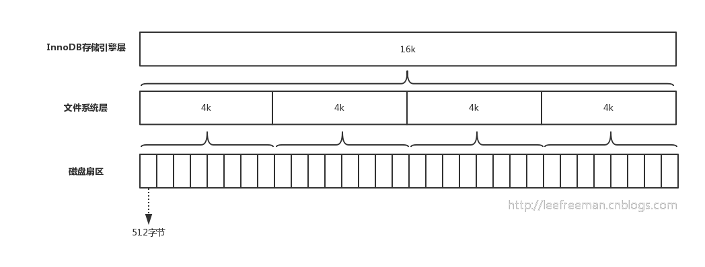

1.Innodb页大小
>```sql
>show VARIABLES like 'innodb_page_size'
>```

2.[B+树聚簇索引][2]
> - 非叶子节点存放键值+指针（指针6字节，页地址）
> - 叶子节点存放行数据，叶节点大小和内节点一般不一样大
> - 增加相邻叶节点顺序访问指针
3.索引结构
> 在InnoDB的表空间文件中，约定page number为3 的代表主键索引的根页，而在根页偏移量为64 的地方存放了该B+树的page level,B+树的高度=page level+1
> 
5.


参考

1: [InnoDB 中一棵 B+ 树能存多少行数据？](https://mp.weixin.qq.com/s/IHdsLjoF8RLyDOYvfor81A)

3: [MySQL索引背后的数据结构及算法原理][2]


[2]: http://blog.codinglabs.org/articles/theory-of-mysql-index.html


